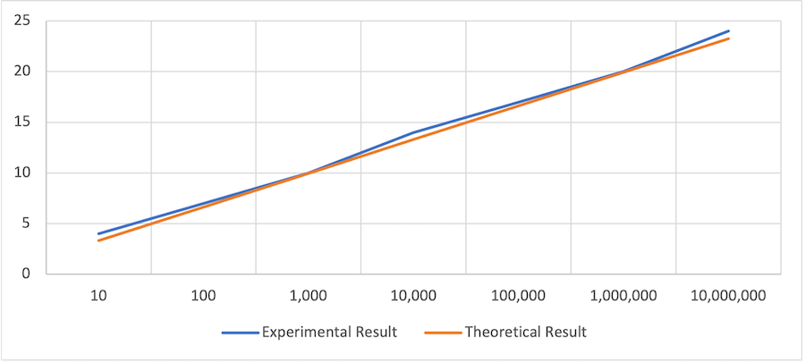

# Finding the Maximum Number in a Circularly Shifted Array

## Overview
This project implements an algorithm to find the maximum number in a circularly shifted array in **O(log n)** time using a divide-and-conquer approach. A circularly shifted array is a sorted array that has been rotated by some positions to the right, such as:

- Example 1: `[35, 42, 5, 15, 27, 29]` (shifted 2 positions)
- Example 2: `[27, 29, 35, 42, 5, 15]` (shifted 4 positions)

---

## Algorithm Description

The divide-and-conquer approach works as follows:

1. **Base Case**: If the array size is 1, return the single element.
2. **Divide**: Find the middle index of the array.
3. **Rotation Point Check**:
   - If the middle element is greater than the next element, the middle element is the maximum.
   - If the middle element is smaller than the previous element, the previous element is the maximum.
4. **Search Direction**:
   - If the left half is sorted (the first element is smaller than the middle element), the maximum lies in the right half.
   - Otherwise, the maximum lies in the left half.
5. **Recursion**: Continue searching in the relevant half.

---

## Pseudocode

```cpp
Function findMax(arr, low, high)

    If low == high
        Return arr[low]

    mid = (low + high) / 2

    If mid < high and arr[mid] > arr[mid + 1]
        Return arr[mid]

    If mid > low and arr[mid] < arr[mid - 1]
        Return arr[mid - 1]

    If arr[low] <= arr[mid]
        Return findMax(arr, mid + 1, high)

    Else
        Return findMax(arr, low, mid - 1)
```

---

## Time Complexity Analysis

1. Each time the function is called, the array is divided in half using the line `mid = (low + high) / 2`.
2. Initially, the algorithm processes `n` elements.
3. With each recursive step, the number of elements to process reduces by half:
   `n, n/2, n/4, n/8, ...`
4. The recursion stops when only one element remains.
5. Work outside of the recursive calls (e.g., comparisons and assignments) takes constant time.
6. Therefore, we can get: `T(n) = T (n/2) + c → T(n) = 𝑶(𝐥𝐨𝐠 𝒏)`.

---

## Experimental Results

The table below compares the experimental results with theoretical predictions:

| Array Size (n)     | Experimental Result (Recursion Depth) | Theoretical Result (log_2(n)) |
|--------------------|--------------------------------------|-----------------------------|
| 10                 | 4                                    | 3.32                        |
| 100                | 7                                    | 6.64                        |
| 1,000              | 10                                   | 9.97                        |
| 10,000             | 14                                   | 13.29                       |
| 100,000            | 17                                   | 16.61                       |
| 1,000,000          | 20                                   | 19.93                       |
| 10,000,000         | 24                                   | 23.25                       |

---

## Graph of Results



## Observations
- The experimental results grow slightly faster than the theoretical predictions but follow the same overall trend.
- The algorithm behaves as expected, confirming its time complexity is **O(log n)**.
